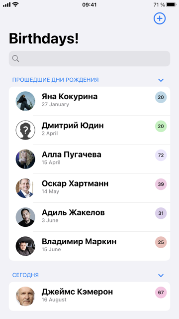
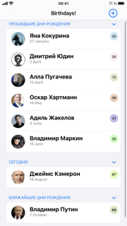
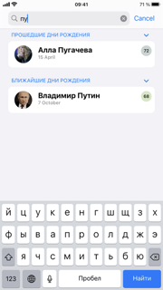
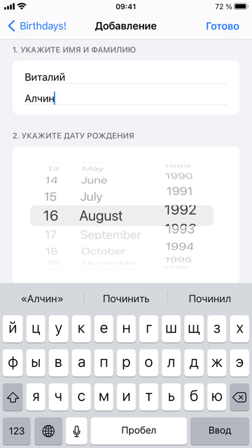
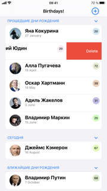
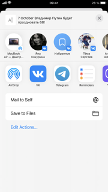
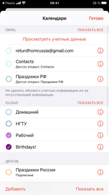
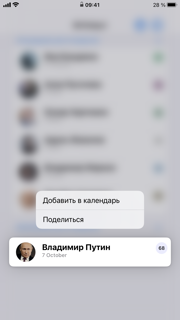

# Birthdays 🎉
Приложение для отслеживания дней рождений. 

- Хранение дней рождений - CoreData
- Возможность добавлять фотографии для людей
- Кружочек справа сверху в ячейке - возраст человека (цвета получаются рандомно, чтобы не было супероднотипно)
- Поиск в списке реализован с помощью [SwiftlySearch](https://github.com/thislooksfun/SwiftlySearch) (потому что писалось под iOS 14.5, для 15+ searchable)
- Свайп влево для удаления 
- Добавление дней рождений в календарь - EKEvent
- Возможность поделиться днем рождения - ActivityController

---
### Скриншоты: 

---
- картинка персонажа отсюда: [тык](http://clipart-library.com/new_gallery/8-87866_unknown-person-icon-png.png)
- иконка приложения: [тык](https://icon-library.com/images/confetti-icon/confetti-icon-29.jpg)
- конвертер картинки в иконки: [тык](https://makeappicon.com)
